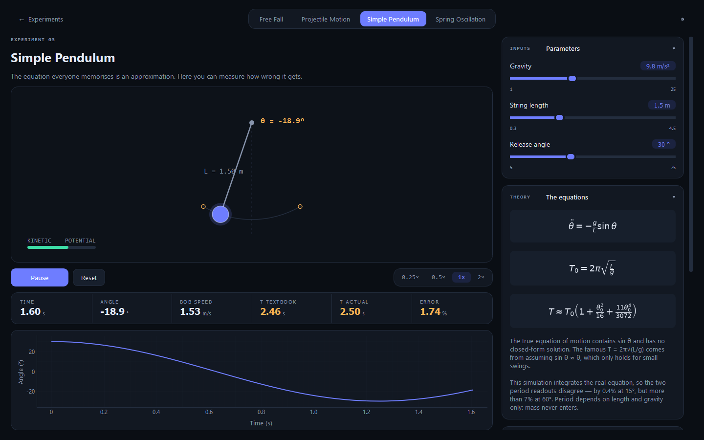
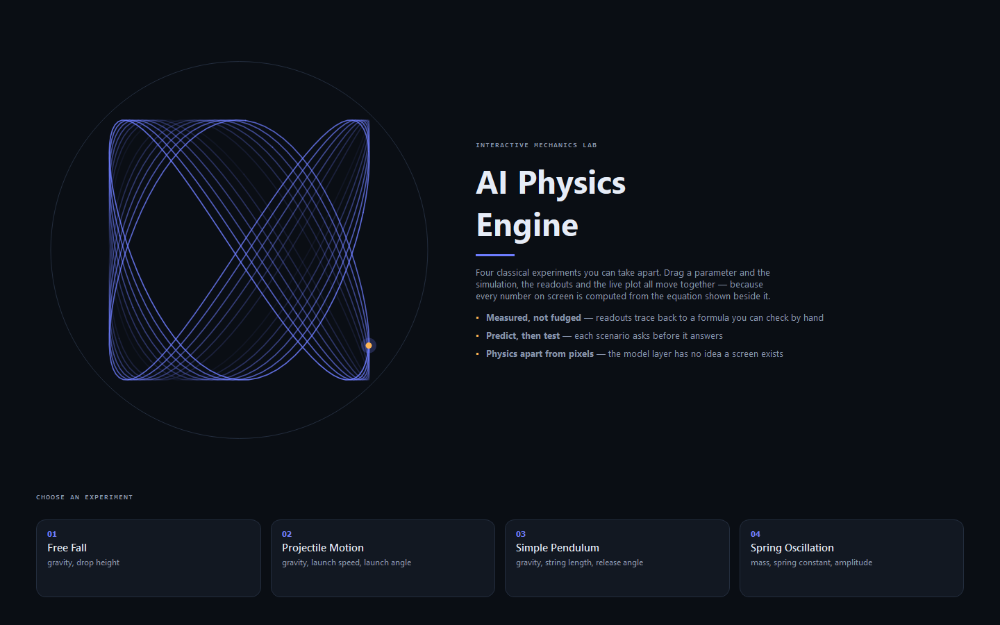

# Mechanics Lab

A desktop application for exploring four classical mechanics experiments:
free fall, projectile motion, spring oscillation and a pendulum. Each one has a
live simulation canvas, real-time telemetry plots, and the equations that
produce the numbers shown beside them.

Built with Python and PySide6 (Qt 6). No web technologies.

<!-- Add screenshots here once you have run tools/screenshot.py:

-->

---

## Overview

The physics is kept strictly separate from the interface. `app/core/` is plain
Python with no Qt in it at all; `app/render/` converts metres to pixels; and
`app/ui/` holds the widgets and layout. Dependencies point one way only:

```
core  ←  render  ←  ui
(pure)   (Qt +      (Qt + core
          core)      + render)
```

`tests/test_layering.py` fails the build if anything in `app/core/` imports
PySide6, pyqtgraph, matplotlib or a UI module. It also spawns a subprocess with
`DISPLAY` unset to confirm the physics loads without a window system. An
architecture diagram in a README goes stale; an assertion does not.

The practical benefit is that the physics is testable on its own. The whole
suite runs with no display and without PySide6 installed.

---

## The physics

Everything is computed in SI units, and every number on screen traces back to a
formula shown in the theory panel. There are no display-only fudge factors.

- **Free fall, projectile, spring** are evaluated in closed form. Position is
  computed from `t` rather than accumulated frame by frame, so it cannot drift.
- **The pendulum** has no closed-form solution, so it integrates
  `θ'' = -(g/L)·sin θ` with semi-implicit (symplectic) Euler: velocity is
  updated first, then position using the *new* velocity. That ordering is what
  bounds the energy error. The test suite measures drift below 1% over 60
  seconds of simulated time; explicit Euler diverges instead.

Because the pendulum is integrated rather than assuming `sin θ ≈ θ`, the app
shows the small-angle period and the true period side by side. They differ by
about 0.4% at 15° and by more than 7% at 60°.

Amber readouts are predicted by the equations. White ones are measured from the
running simulation. They should agree, which is the point.

---

## Interface

- **Landing screen.** Two `SpringModel` oscillators at a 1.51 frequency ratio
  drive the x and y of a single point, tracing a Lissajous figure that never
  quite closes. The engine is already running before you open an experiment.
- **Dashboard.** Two columns: simulation, transport, readouts and telemetry on
  the left; parameters and collapsible theory, discovery and source panels on
  the right.
- **Predict, then test.** Each scenario poses a question, applies a parameter
  preset, and reveals the explanation only after the run.
- Keyboard: `Space` run/pause, `R` reset, `T` theme, `Esc` back.

---

## Why PySide6

| Option | Verdict |
|---|---|
| **PySide6 (chosen)** | Qt 6 under the LGPL. Real layout system, `QPainter` for the canvas, `QPropertyAnimation` for motion, same class names as C++ Qt. |
| PyQt6 | Same Qt, but GPL or a paid licence, which would constrain how this repository can be licensed. |
| CustomTkinter | Tkinter underneath: no real animation framework and a weak canvas. |
| C++ / Qt | Identical API, far more build friction, and this app is not compute-bound. |
| C++ / Dear ImGui | Immediate mode. Excellent for tooling, but it looks like tooling. |
| C++ / raylib | A renderer, not a UI toolkit. Sliders and text layout would be hand-built. |

The physics here is a handful of floating-point operations per frame, so
nothing is compute-bound and choosing C++ for speed would solve a problem that
does not exist. What Qt provides is the layout engine, the animation framework
and the widget set. `QPropertyAnimation`, `QPainter`, `QStackedWidget` and
signal/slot carry the same names in C++ Qt, and `app/core/` contains no
framework code at all, so a port would be mechanical.

---

## Installation

Python 3.10 or newer.

```bash
git clone https://github.com/<your-username>/mechanics-lab.git
cd mechanics-lab

python -m venv .venv
source .venv/bin/activate          # Windows: .venv\Scripts\activate
pip install -r requirements.txt
```

## Usage

```bash
python main.py
```

## Testing

```bash
python -m pytest tests -v
```

14 tests: closed-form agreement for free fall and projectile, complementary
angles sharing a range, the integrated pendulum period matching the exact
series expansion from 5° to 75°, energy conservation under the symplectic
integrator, spring period and mass scaling, and the two architecture
assertions. They need neither a display nor PySide6.

---

## Project structure

```
mechanics-lab/
├── main.py                     entry point
├── requirements.txt
├── app/
│   ├── theme.py                design tokens + generated Qt stylesheet
│   ├── core/                   ── PURE PHYSICS. No Qt. ──────────────
│   │   ├── model.py            PhysicsModel ABC + the four models
│   │   └── catalog.py          experiment definitions (pure data)
│   ├── render/                 ── METRES TO PIXELS ──────────────────
│   │   ├── scene.py            Scene ABC + painting helpers
│   │   ├── scenes.py           one QPainter routine per experiment
│   │   └── canvas.py           the clock and the frame loop
│   └── ui/                     ── WIDGETS AND LAYOUT ────────────────
│       ├── window.py           QMainWindow + QStackedWidget
│       ├── landing.py          animated landing screen
│       ├── dashboard.py        the two-column grid
│       └── widgets/            sliders, readouts, formulas, panels, plot
├── tests/
│   ├── test_models.py          physics correctness
│   └── test_layering.py        asserts core/ never imports the GUI
└── tools/screenshot.py         offscreen render harness (development only)
```

Adding a fifth experiment means a model class in `model.py`, a scene in
`app/render/scenes.py`, and one `Experiment` entry in `catalog.py`. Sliders,
readouts, theory panel, telemetry axes and discovery cards are all generated
from that description. `catalog.py` names its scene by string rather than
importing the class, which is what keeps the core free of any render import.

---

## Limitations

- Air resistance is ignored throughout, as the equations shown assume.
- The small-angle series for the pendulum period is truncated after the θ⁴
  term; beyond roughly 80° it would need more terms.
- Changing a parameter restarts the run, since the initial conditions have
  changed and continuing the old run would be meaningless.
- There is no AI or machine learning component in this project. An earlier
  working title suggested otherwise.

## Licence

MIT. PySide6 is used under the LGPL, which permits this.
